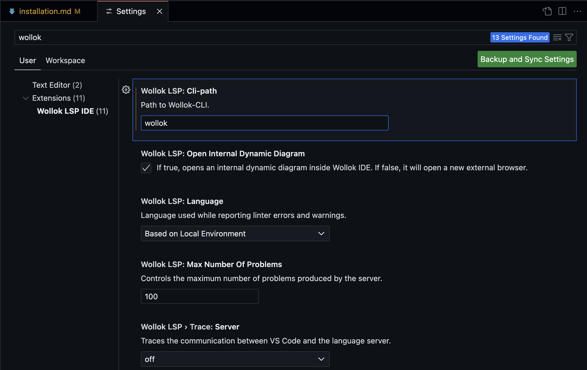

## Componentes básicos

- Wollok (el intérprete del lenguaje)
- IDE (Visual Studio Code)
- Extensiones (desarrolladas para VSC)

### Wollok 
El intérprete del lenguaje es Wollok-CLI (Command Line Interface)
Es el ejecutable que corre los programas Wollok. 
Hay dos formas de instalarlo:
- Via Node (recomendada en computadoras de uso personal)
:::note[Recomendada]
Es la forma recomendada de instalar Wollok, por ser la variante más simple, por tener una forma de actualización ágil y por tener optimizaciones que mejoran su performance. Si llegás a tener inconvenientes, podés probar la [instalación alternativa](/getting_started/installation_alternative).
:::
- Descargando ejecutable (alternativa para computadoras de uso compartido) 
:::caution[Alternativa]
Esta alternativa se aconseja si surgen conflictos con otras instalaciones de Node, si surgen dificultades con la variante recomendada, o si es para un uso eventual) 
:::
En ambos casos, tener en cuenta las particularidades del sistema operativo.

### IDE
El Entorno Integrado de Desarrollo (IDE) recomenado es Visual Studio Code (VSC), por contar con las extensiones que hacen más grata la experiencia de aprender a programar con Wollok. 
De todas maneras, el código fuente es simplemente texto y se puede editar con cualquier editor.
Instalar [VSCode](https://code.visualstudio.com/).

### Extensiones
Estas instrucciones para instalar y configurar las extensiones de Wollok para VSC son independientes del sistema operativo de tu máquina.

1. **Abrir el VSCode**

2. Instalar las extensiones [`wollok-lsp-ide`](https://marketplace.visualstudio.com/items?itemName=uqbar.wollok-lsp-ide) y [`wollok-highlight`](https://marketplace.visualstudio.com/items?itemName=uqbar.wollok-highlight) disponibles en los links o directamente desde el _Marketplace_ del VSCode. El orden en el que instales las extensiones es indistinto.

Podés ir a la tab de Extensiones, buscar 'wollok' e instalarlas como muestra esta imagen:

3. Si todo salió bien deberías poder ver ambas extensiones instaladas en tu VSCode:

4. Ahora es necesario **configurar la extensión** para que pueda usar _Wollok-CLI_ para correr programas.

- Ir a la pestaña de "ajustes" (o "settings" en inglés) del VSCode: `Ctrl + ,` o desde el menú: `Code -> Preferencias -> Ajustes`. Y buscar por `wollok`.

- El primer ajuste que aparecerá es para indicar el _path_ donde se encuentra Wollok Command Line Interface (CLI). Para eso es necesario Ingresar en el campo: `wollok`.
:::note[Alternativa] 
En caso de haber seguido la instalación alternativa y no haber podido renombrar el ejecutable o configurar la variable de ambiente, ingresar  **la dirección _absoluta_ del ejecutable de wollok-cli descargado**.
:::

- También hay otras configuraciones, como seleccionar el idioma en que querés que se muestren los mensajes de errores.

- Al final debería verse algo así:

**¡Listo!**

Ya deberías poder usar VSCode con Wollok.

## Videos explicativos

**Windows** 
<iframe width="560" height="315" src="https://www.youtube.com/embed/kPxbjL7WUHc?si=lmdkD9oF2SxMpFeg" title="YouTube video player" frameborder="0" referrerpolicy="strict-origin-when-cross-origin" allowfullscreen></iframe>

**Linux**
<iframe width="560" height="315" src="https://www.youtube.com/embed/DCG-syufqhU?si=SBMGmBkEz6bS1-Wo" title="YouTube video player" frameborder="0" referrerpolicy="strict-origin-when-cross-origin" allowfullscreen></iframe>

## Próximos pasos

¿Cómo seguimos?

- Podés ver cómo [crear un proyecto Wollok de cero](/getting_started/new_project).
- Podés descargarte un [ejemplo](/material/examples) y probarlo
- Si ya tenés un proyecto Wollok en tu VSCode te recomendamos hacer el [Tour por las herramientas que soportamos](/tour/console) para sacarle todo el potencial al IDE.
- Si tenés dudas sobre algo del lenguaje podés [ir a la documentación](/documentation/introduction).
