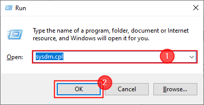

## Wollok Command Line Interface: vía ejecutable

Es un serie de pasos que se debe realizar inicialmente y repetirla  cada vez que haya una nueva versión disponible. 
- Descargar un archivo ejecutable
- Renombrarlo
- Ubicarlo en una carpeta donde se tenga acceso
- Garantizar que tenga permiso de ejecución.

La forma de realizarlos depende de cada Sistema Operativo

-  en una carpeta que esté la carpeta, consiste en descargar un archivo ejecutable según el sistema operativo, ubicarlo en una carpeta con el nombre correcto el Path y garantizar que tenga permiso de ejecución.
Anta la 

1. Descargar la _Wollok Command Line Interface_ (CLI) disponible para [Linux](https://github.com/uqbar-project/wollok-ts-cli/releases/latest/download/wollok-ts-cli-linux-x64), [MacOS](https://github.com/uqbar-project/wollok-ts-cli/releases/latest/download/wollok-ts-cli-macos-x64) (versión [arm64](https://github.com/uqbar-project/wollok-ts-cli/releases/latest/download/wollok-ts-cli-macos-arm64)) y 

2. Luego vamos a **renombrar el ejecutable** a wollok (o wollok.exe) para facilitar su uso desde una terminal.
3. Y también **lo ubicaremos dentro del PATH del sistema operativo** para que lo reconozca desde cualquier carpeta. 

A continuación te dejamos las instrucciones para cada caso.

### Windows

1. Descargar la _Wollok Command Line Interface_ (Wollok-CLI) disponible para [Windows](https://github.com/uqbar-project/wollok-ts-cli/releases/latest/download/wollok-ts-cli-win-x64.exe).

Teniendo en cuenta que nos descargamos la versión de Wollok CLI de Windows en la carpeta `Downloads` del usuario logueado  y que el usuario se llama `NombreDeUsuario`, haremos lo siguiente

2. Crear una carpeta `Wollok` dentro del home del usuario (en este caso: `C:\Users\NombreDeUsuario`)
3. Mover el archivo de la carpeta `C:\Users\NombreDeUsuario\Downloads` a `C:\Users\NombreDeUsuario\Wollok`. Es importante dejarlo dentro de las carpetas del usuario logueado para no tener problemas de permisos.
4. Renombrar el ejecutable a `wollok.exe`.


5. Por último vamos a agregar la carpeta Wollok que acabamos de crear a la lista de carpetas que forman parte del PATH. Para eso abrimos la configuración de variables de entorno:

- activamos la ventana de ejecución de comandos con las teclas `Windows` y `R`
- escribimos `sysdm.cpl` que es el programa que levanta el `Panel de Control`



- una vez posicionada en la solapa "Avanzados", presionamos el botón "Variables de entorno" (Environment variables)
- en la primera de la listas (la que corresponde al usuario logueado), seleccionamos la variable Path (puede ser que tengas que scrollear para encontrarla) y luego presionamos el botón "Editar" (Edit)
- hay que seleccionar con el mouse la primera línea vacía y escribimos allí la dirección de la carpeta donde dejamos el ejecutable, en nuestro caso `C:\Users\NombreDeUsuario\Wollok`
- hacemos click en "Ok" y nuevamente en "Ok" dos veces para salir


6. Para comprobar que Wollok-CLI se instaló correctamente nos posicionamos en una carpeta diferente a `C:/Users/NombreDeUsuario/Wollok` y ejecutamos `wollok --version` en cualquier terminal (podés usar Powershell, CMD o Git Bash, el resultado es el mismo):


:::note[Sobre la versión]
La versión que muestre será la última que te hayas descargado (no tiene que ser 0.2.2)
:::

### Linux

1. Primero vamos a necesitar levantar una terminal con `Ctrl + Alt + T` o buscando `Terminal` en la barra de herramientas

2. Asumimos que descargamos la versión del cli en la carpeta `~/Downloads` (`~` es la carpeta raíz del usuario logueado), vamos a renombrar el archivo a `wollok`, darle permisos de ejecución (`chmod a+x`), pasarlo a la carpeta `/usr/local/bin` y confirmar con `ls -la` que el archivo está en esa carpeta y que tiene las tres `x` correspondientes a los permisos de ejecución. Lo hacemos con una serie de comandos como la siguiente: 
   
```bash
cd ~/Downloads
ls -la wollok-ts-cli*
mv ./wollok-ts-cli* ./wollok
chmod a+x ./wollok
sudo mv ./wollok /usr/local/bin/wollok # nos va a pedir la clave de usuario root
ls -la /usr/local/bin/wollok
```

Te mostramos cómo se hace esta parte desde una terminal:


3. Para verificar que está correctamente instalado, escribimos `wollok --version` en la consola desde cualquier carpeta, y nos debe devolver el número de versión (también podemos ejecutar `wollok --help`):


:::note[Sobre la versión]
La versión que muestre será la última que te hayas descargado (no tiene que ser 0.2.2)
:::

### Mac

1. Vamos a necesitar levantar una terminal con `⌘ (Cmd) + Espacio` o buscando `Terminal` en el Launchpad

2. Asumimos que descargamos la versión de Wollok-CLI en la carpeta `~/Downloads` (`~` es la carpeta raíz del usuario logueado) y vamos a renombrar el archivo a `wollok`, darle permisos de ejecución (`chmod a+x`), pasarlo a la carpeta `/usr/local/bin` y confirmar con `ls -la` que el archivo está en esa carpeta y tiene las tres `x` correspondientes a los permisos de ejecución. Lo hacemos con la siguiente secuencia:

```bash
cd ~/Downloads
ls -la wollok-ts-cli*
mv ./wollok-ts-cli* ./wollok
chmod a+x ./wollok
sudo mv ./wollok /usr/local/bin/wollok # te va a pedir la clave de usuario root
ls -la /usr/local/bin/wollok
```

Te mostramos cómo hacerlo desde una terminal de Mac:


3. Para verificar que esté correctamente instalado necesitamos algunos pasos más gracias al mecanismo de seguridad que trae el sistema operativo Mac:

- debemos ejecutar `wollok --version` la primera vez
- va a aparecer una ventana avisando que no puede ejecutarlo, hacemos click en la opción `Show in Finder`
- en el Finder hacemos click derecho y en las opciones, nuevamente `Open`
- eso abre una Terminal, y una **nueva ventana de confirmación**. Esta vez en lugar de `Show in Finder` seleccionamos `Open`
- ahora sí termina de ejecutarse el comando: cerramos la terminal que nos abrió Mac y volvemos a nuestra terminal original
- a partir de ahora ya podemos ejecutar `wollok --version` normalmente


:::note[Sobre la versión]
La versión que muestre será la última que te hayas descargado (no tiene que ser 0.2.2)
:::

