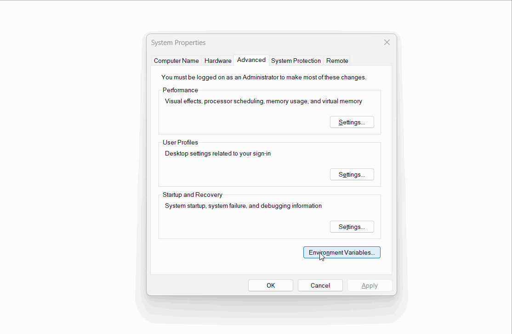
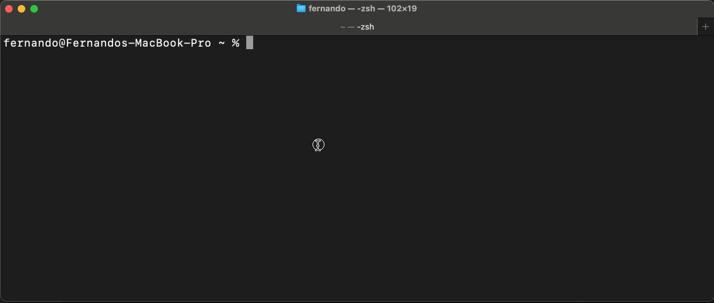
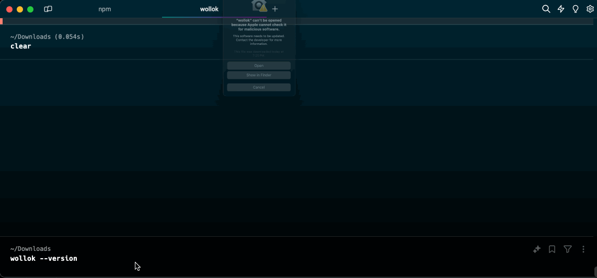

## Pre-requisitos

Tener instalado [VSCode](https://code.visualstudio.com/).

## Wollok Command Line Interface: vía ejecutable

:::caution[Alternativa]
Esta alternativa solo te la aconsejamos si tuviste dificultades con la variante recomendada de instalarlo mediante Node
:::

1. Descargar la _Wollok Command Line Interface_ (CLI) disponible para [Linux](https://github.com/uqbar-project/wollok-ts-cli/releases/latest/download/wollok-ts-cli-linux-x64), [MacOS](https://github.com/uqbar-project/wollok-ts-cli/releases/latest/download/wollok-ts-cli-macos-x64) (versión [arm64](https://github.com/uqbar-project/wollok-ts-cli/releases/latest/download/wollok-ts-cli-macos-arm64)) y [Windows](https://github.com/uqbar-project/wollok-ts-cli/releases/latest/download/wollok-ts-cli-win-x64.exe).

2. Luego vamos a **renombrar el ejecutable** a wollok (o wollok.exe) para facilitar su uso desde una terminal y **lo ubicaremos dentro del PATH de nuestro sistema operativo** para que lo reconozca desde cualquier carpeta. A continuación te dejamos las instrucciones para cada caso.

### Windows

Teniendo en cuenta que en la carpeta `Downloads` del usuario logueado nos descargamos la versión de Wollok TS CLI de Windows y que el usuario se llama `Usuario`, haremos lo siguiente

- crear una carpeta `Wollok` dentro del home del usuario (en este caso: `C:\Users\Usuario`)
- mover el archivo de la carpeta `C:\Users\Usuario\Downloads` a `C:\Users\Usuario\Wollok`. Es importante dejarlo dentro de las carpetas del usuario logueado para no tener problemas de permisos.
- renombrar el ejecutable a `wollok.exe` para que sea más comodo de utilizar


Por último vamos a agregar la carpeta Wollok que acabamos de crear a la lista de carpetas que forman parte de nuestro PATH. Para eso abrimos la configuración de variables de entorno:

- activamos la ventana de ejecución de comandos con las teclas `Windows` y `R`
- escribimos `sysdm.cpl` que es el programa que levanta el `Panel de Control`


- una vez posicionada en la solapa "Avanzados", presionamos el botón "Variables de entorno" (Environment variables)
- en la primera de la listas (la que corresponde al usuario logueado), seleccionamos la variable Path (puede ser que tengas que scrollear para encontrarla) y luego presionamos el botón "Editar" (Edit)
- hay que seleccionar con el mouse la primera línea vacía y escribimos allí la dirección de la carpeta donde dejamos el ejecutable, en nuestro caso `C:\Users\Usuario\Wollok`
- hacemos click en "Ok" y nuevamente en "Ok" dos veces para salir



Para comprobar que el CLI se instaló correctamente nos posicionamos en una carpeta diferente a `C:/Users/Usuario/Wollok` y ejecutamos `wollok --version` en cualquier terminal (podés usar Powershell, CMD o Git Bash, el resultado es el mismo):


:::note[Sobre la versión]
La versión que muestre será la última que te hayas descargado (no tiene que ser 0.2.2)
:::

### Linux

- Para este punto vamos a necesitar levantar una terminal con `Ctrl + Alt + T` o buscando `Terminal` en la barra de herramientas

- Asumimos que descargaste la versión del cli en la carpeta `~/Downloads` (`~` es la carpeta raíz del usuario logueado). Desde aquí vamos a renombrar el archivo ejecutable y le vamos a dar permisos de ejecución:

```bash
cd ~/Downloads
ls -la wollok-ts-cli*
mv ./wollok-ts-cli* ./wollok
chmod a+x ./wollok
sudo mv ./wollok /usr/local/bin/wollok # te va a pedir la clave de usuario root
ls -la /usr/local/bin/wollok
```

Te mostramos cómo se hace esta parte desde una terminal:


Lo que hacemos es renombrar el archivo a `wollok`, darle permisos de ejecución (`chmod a+x`), pasarlo a la carpeta `/usr/local/bin` y confirmar con `ls -la` que el archivo está en ese directorio. El archivo debe tener las tres `x` correspondientes a los permisos de ejecución.

Para verificar que está correctamente instalado, escribimos `wollok --version` en la consola desde cualquier carpeta, y nos debe devolver el número de versión (también podemos ejecutar `wollok --help`):


:::note[Sobre la versión]
La versión que muestre será la última que te hayas descargado (no tiene que ser 0.2.2)
:::

### Mac

- Para este punto vamos a necesitar levantar una terminal con `⌘ (Cmd) + Espacio` o buscando `Terminal` en el Launchpad

- Asumimos que descargaste la versión del cli en la carpeta `~/Downloads` (`~` es la carpeta raíz del usuario logueado). Desde aquí vamos a renombrar el archivo ejecutable y le vamos a dar permisos de ejecución:

```bash
cd ~/Downloads
ls -la wollok-ts-cli*
mv ./wollok-ts-cli* ./wollok
chmod a+x ./wollok
sudo mv ./wollok /usr/local/bin/wollok # te va a pedir la clave de usuario root
ls -la /usr/local/bin/wollok
```

Te mostramos cómo hacerlo desde una terminal de Mac:



Lo que hacemos es renombrar el archivo a `wollok`, darle permisos de ejecución (`chmod a+x`), pasarlo a la carpeta `/usr/local/bin` y confirmar con `ls -la` que el archivo está en ese directorio. El archivo debe tener las tres `x` correspondientes a los permisos de ejecución.

Para verificar que esté correctamente instalado, ecesitamos algunos pasos más gracias al mecanismo de seguridad que trae el sistema operativo Mac:

- debemos ejecutar `wollok --version` la primera vez
- va a aparecer una ventana avisando que no puede ejecutarlo, hacemos click en la opción `Show in Finder`
- en el Finder hacemos click derecho y en las opciones, nuevamente `Open`
- eso abre una Terminal, y una **nueva ventana de confirmación**. Esta vez en lugar de `Show in Finder` seleccionamos `Open`
- ahora sí termina de ejecutarse el comando: cerramos la terminal que nos abrió Mac y volvemos a nuestra terminal original
- a partir de ahora ya podemos ejecutar `wollok --version` normalmente



:::note[Sobre la versión]
La versión que muestre será la última que te hayas descargado (no tiene que ser 0.2.2)
:::


## Extensiones de Wollok para VSC

Estas instrucciones son independientes del sistema operativo de tu máquina.

1. **Abrir el VSCode**

2. Instalar las extensiones [`wollok-lsp-ide`](https://marketplace.visualstudio.com/items?itemName=uqbar.wollok-lsp-ide) y [`wollok-highlight`](https://marketplace.visualstudio.com/items?itemName=uqbar.wollok-highlight) disponibles en los links o directamente desde el _Marketplace_ del VSCode. El orden en el que instales las extensiones es indistinto.

Podés ir a la tab de Extensiones, buscar 'wollok' e instalarlas como muestra esta imagen:


3. Si todo salió bien deberías poder ver ambas extensiones instaladas en tu VSCode:


## Configuración

Ahora es necesario **configurar la extensión** para que pueda usar _Wollok-CLI_ para correr programas.

1. Ir a la pestaña de "ajustes" (o "settings" en inglés) del VSCode: `Ctrl + ,` o desde el menú: `Code -> Preferencias -> Ajustes`. Y buscar por `wollok`.

2. El primer ajuste que aparecerá es para indicar el _path_ donde se encuentra Wollok Command Line Interface (CLI). Para eso es necesario 1. utilizar el nombre "wollok" si seguiste los pasos de instalación o bien 2. copiar **la dirección _absoluta_ del ejecutable que te descargaste antes** y pegarlo en el campo.

:::caution[Atención]
Este paso es necesario para poder ejecutar código.
:::

1. También hay otras configuraciones, como seleccionar el idioma en que querés que se muestren los mensajes de errores.

2. Al final debería verse algo así:


**¡Listo!**

Ya deberías poder usar VSCode con Wollok.


## Próximos pasos


¿Cómo seguimos?

- Podés ver cómo [crear un proyecto Wollok de cero](/website-wollok-ts/getting_started/new_project).
- Si ya tenés un proyecto Wollok en tu VSCode te recomendamos hacer el [Tour por las herramientas que soportamos](/website-wollok-ts/tour/console) para sacarle todo el potencial al IDE.
- Si tenés dudas sobre algo del lenguaje podés [ir a la documentación](/website-wollok-ts/documentation/introduction).
